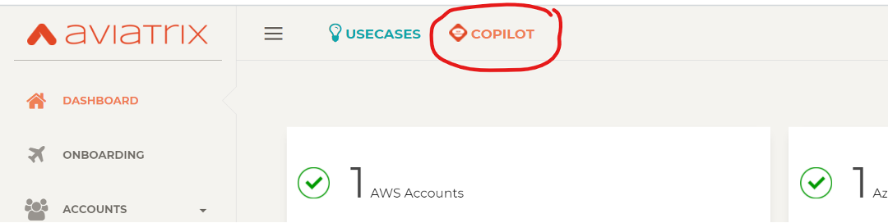
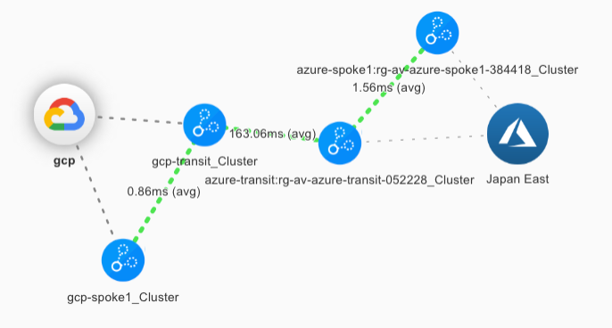

# Lab 1

## Lab Overview - What's in the lab?
Lab time: ~20 minutes

In this lab, we are going to explore our lab environment. The diagram below shows the current state of the lab environment. You will extend this environment during the exercises. The instructor will briefly explain the lab setup in the diagram. You can find a more complete and detailed diagram here.


_Fig. Lab Overview_

## Lab 1.1 - Aviatrix Controller
### Description
Navigate and login to the Aviatrix Controller.
### Validate
Open your browser and navigate to:

**URL:** ```https://ctrl.pod[x].aviatrixlab.com```  
**User:** ```admin```  
**Password:** ```Password123!```

* _(replace **[x]** with your pod ID)_

### Expected Results
Explore the Dashboard. As you can see, there are already gateways deployed in different CSP environments. Do they seem connected to each other? Do you think this connection is working? Why do you think so?

## Lab 1.2 - Access Accounts
### Description
In order for the controller to be able to access the different CSP environments, we need to provide it with accounts with the correct privileges.
### Validate
Have a look at the access accounts already set up under **_Accounts -> Access Accounts_**    
### Expected Results
Accounts in GCP, AWS and Azure have already been onboarded and you should see the three accounts in the list.  The accounts should also be green, meaning the permissions in the accounts are correctly configured.

## Lab 1.3 - Connectivity Check
### Description
Each spoke VPC / VNET contains a Linux VM to test connectivity.  The purpose of this exercise is to verify the connectivity between Linux VMs in the spoke VPCs / VNETs in the 3 different clouds.
### Validate
In order execute the connectivity tests, we need to log on to the test instances we have deployed throughout the lab. We use a web based SSH tool for this. Browse to:  

**URL:** ```https://web.pod[x].aviatrixlab.com```  
**User:** ```admin```  
**Password:** ```Password123```  

* _(replace [x] with your pod ID)_
* _If you want to use copy/paste in this Guacamole web console, use CTRL+ALT+SHIFT on a Windows device or CTRL+CMD+SHIFT on a MacOS device._

1- Connect into **GCP-SRV1** from the *ALL CONNECTIONS* pane. (Tip: use right-click open in new tab)  
2- Run the following commands:
```
ping azure-srv1-priv.pod[x].aviatrixlab.com  
ping aws-srv1-priv.pod[x].aviatrixlab.com  
ping aws-srv2-priv.pod[x].aviatrixlab.com  
ping shared-priv.pod[x].aviatrixlab.com
```  
### Expected Results
Not all of the ping tests will be successful.  Look at the Diagram in the Lab 1 Overview and you will see that only Azure and GCP are connected so far, but AWS is not connected, therefore the connectivity tests from GCP to AWS will not work.

## Lab 1.4 - Exploring the Aviatrix Gateways
### Description
As you can see from the lab diagram, there are already some Aviatrix gateways deployed. Let’s see where we can find them in the controller.
### Validate
Go to **_Multi-Cloud Transit -> List_**. As you can see, this is where the existing transit gateways are listed. Look at the following fields: Name, VPC CIDR, Spoke List and Transit Peering. Try to derive the existing topology as seen on the lab diagram from this information.  
### Expected Results
You should be able to view the VPC / VNET and Gateway Route Tables for both the Transit Gateways and Spoke Gateways.

## Lab 1.5 - CoPilot
### Description
Along with the Aviatrix Controller, CoPilot is also deployed in the Shared Services VPC.  CoPilot will be your best buddy for visualizing and operating the Multi-Cloud environment.
### Validate
You can log into CoPilot by clicking on the Single Sign-On button in the controller:  

  
_Fig. CoPilot Link_  
  
You can familiarize yourselves with the different functions in CoPilot and after each lab, we can verify the results in CoPilot.  

The Dashboard tab provides a global overview of your Multi-Cloud network, the status, how much traffic is flowing, locations deployed, etc.  

Topology will visualize the connectivity of the Multi-Cloud environment.  In the Topology view, all objects within a VPC/VNET are clustered together.  To open up a cluster, simply double-click.  This will display subnets, instances, Aviatrix Gateways, etc within a VPC/VNET.  Topology will also show you latency between links, and allows you to initiate some troubleshooting commands directly from the map.  

Tip: Double click on the blue bubbles for more detail!
### Expected Results
By clicking the CoPilot link in the Controller, you should be redirected to CoPilot and automatically signed in.  You should be able to view Topology and see the current Multi-Cloud Network topology.  Topology should look similar to this:  

  
_Fig. Initial Topology_  
