# Lab 2

## Create VPCs/VNets and deploy Aviatrix gateways?
Lab time: ~60 minutes

In this lab, we will begin to build out the multi-cloud network.  We will create VPCs, deploy Aviatrix Transit and Spoke Gateways and create transit peerings to peer the different clouds together.  We will also connect an on-prem Data Center to the cloud.

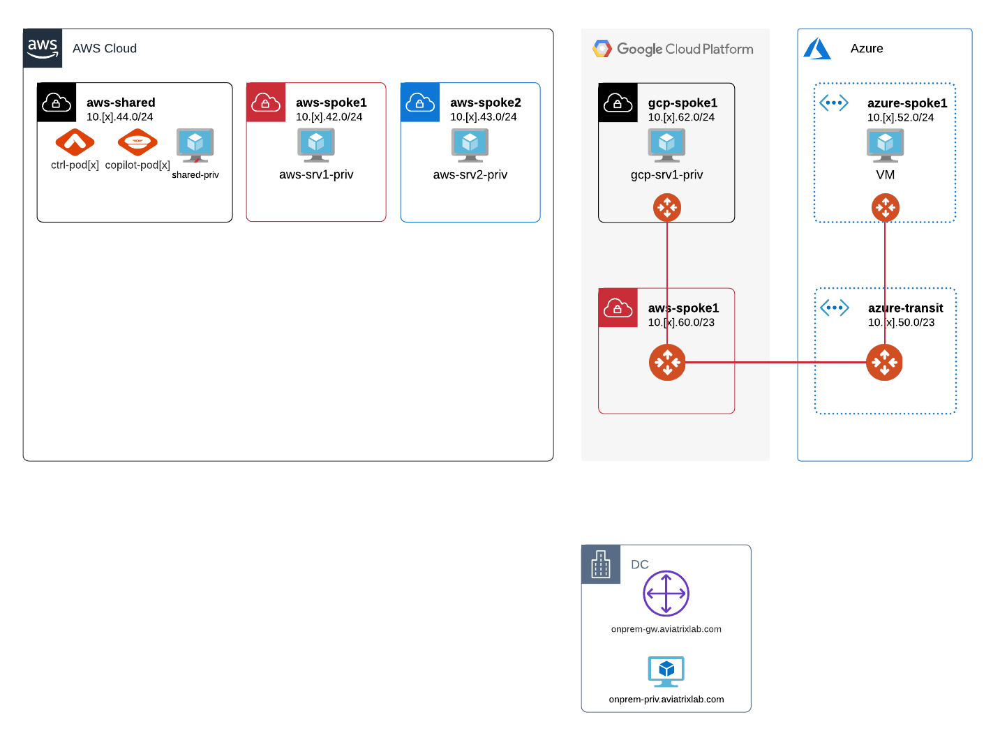
_Fig. Lab Overview_

## Lab 2.1 - Deploy the AWS transit VPC
### Description
As the instructor explained in the first lab, we already have a transit VPC/VNET in Azure and GCP. In this lab, we are going to make the preparations to deploy the aviatrix gateways in the AWS environment. In order to do so, we need a VPC. Instead of having to use the CSP’s console to do this, the controller can do this for us.
### Validate
Go to **_Useful Tools -> Create a VPC_**. As you can see, there already are multiple VPC’s here. See if you can identify these VPC’s on the lab diagram.  
  
Now click the add new button. Add a new VPC with the following settings:  
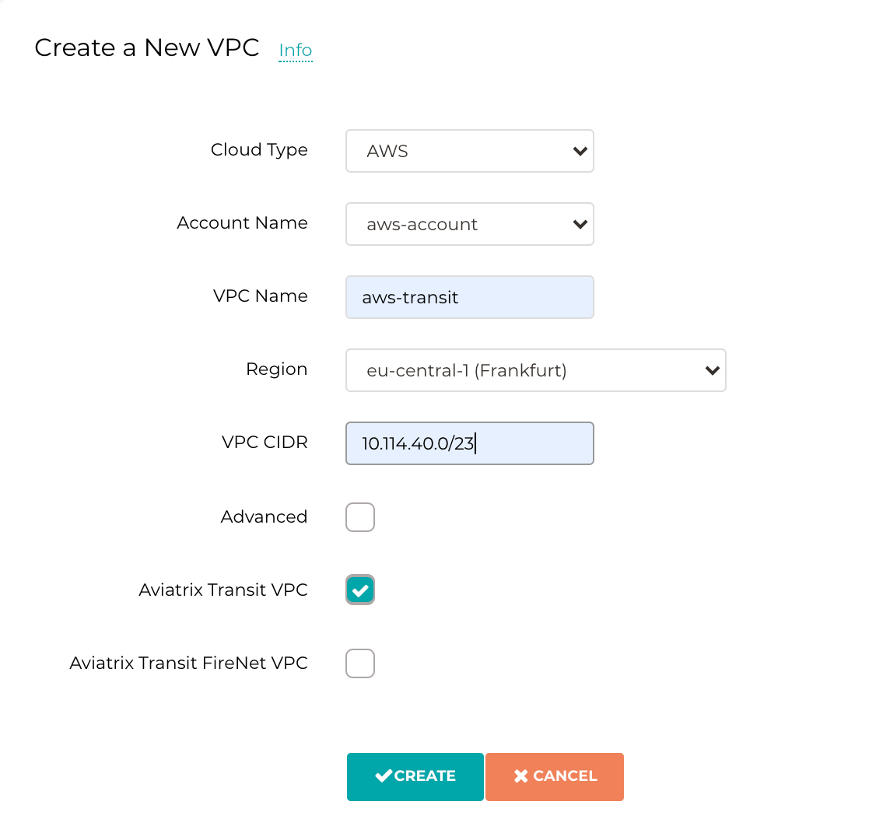  
_Fig. Create Transit VPC_  
  
For the VPC CIDR, replace “x” with your pod number. For example, if your pod number is 11. “x” should be replaced with 11, so the complete CIDR will become 10.11.40.0/23. Make sure Aviatrix Transit VPC is checked. The add VPC tool will automatically create all the required public and private subnets, IGW and routing tables.  
  
By default, it will use the assigned CIDR to add a private and public subnet to each availability zone in AWS. As of version 6.1, we can modify this behavior in the Advanced settings. Click add new again from the Create a VPC window and have a look at these settings. Try creating and deleting some VPC’s and VNET’s.
### Expected Results
Our environment now looks like this:  
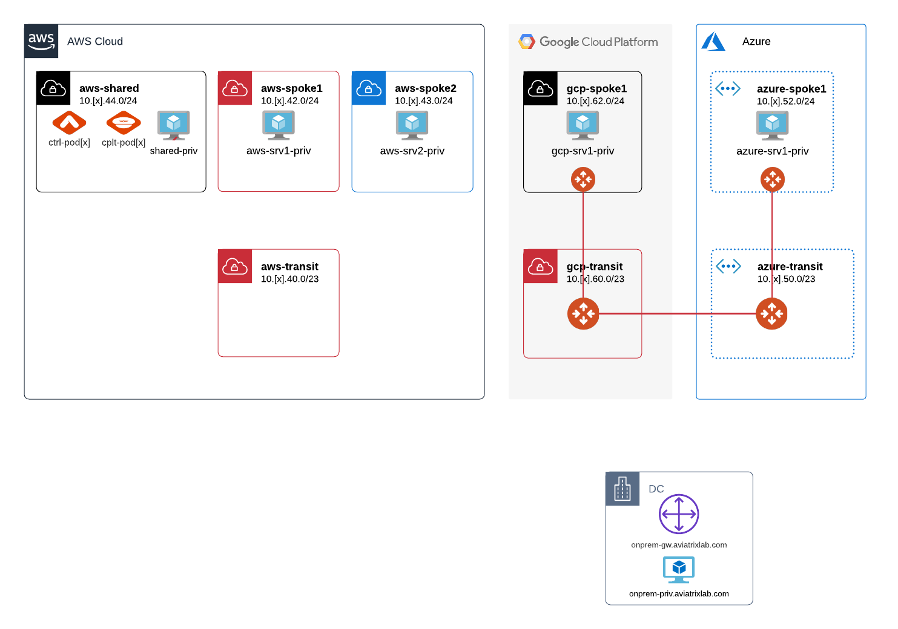  
_Fig. Topology_  

Check out the CoPilot Topology View.  Do you see the newly created Transit VPC?

## Lab 2.2 - Deploy the Aviatrix transit gateway
### Description
In this exercise we are going to launch the Aviatrix transit gateway in the newly created Transit VPC in AWS. 
### Validate
Browse to **_Multi-Cloud Transit -> Setup_** and launch a new transit gateway via step 1 with the settings below.  

The VPC ID will differ from your environment, but we will select the VPC that we just created and named _aws-transit_. For the public subnet, use the one that has _Public-gateway_ in the name and is located in availability zone _a_. You can click on any of the info buttons if you want to understand what the other settings relate to. Click create when you are ready. This will take a few minutes, have a coffee.  
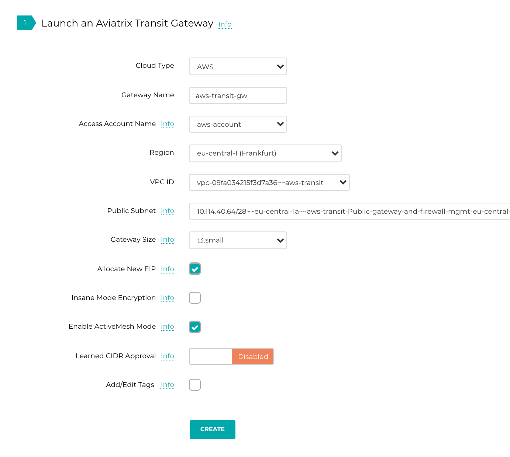  
_Fig. Create Aviatrix Transit Gateway_  
  
Once the gateway has been deployed, take a look at step 2 on this setup page. We are not deploying an HA solution in this workshop, but you can see how easy it is to deploy a second gateway and cluster them in an HA pair.  
### Expected Results
Our environment now looks like this:  
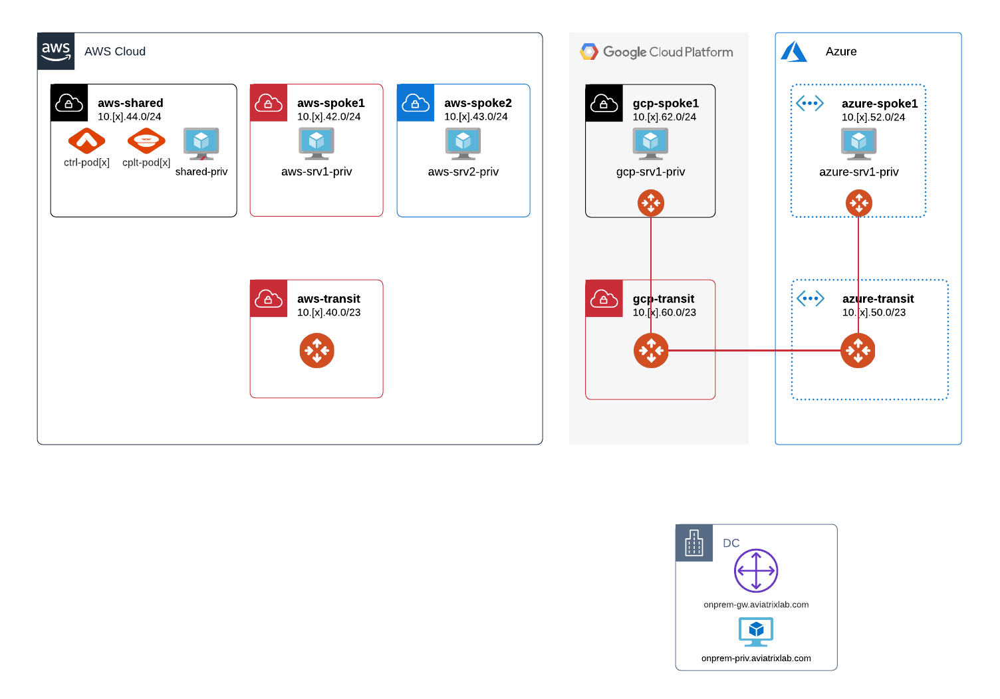  
_Fig. Topology with AWS Transit_  

Check out CoPilot Topology.  Why is the AWS Transit cluster now visible?  
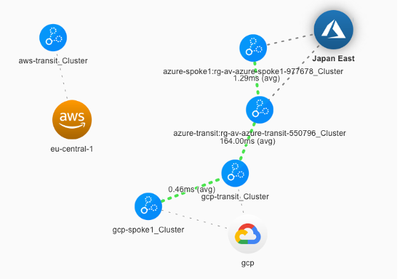  
_Fig. Copilot Topology_  

## Lab 2.3 - Deploy the spoke gateways
### Description
Now that we have our transit set up, we will deploy the Aviatrix spoke gateways in the *AWS spoke VPC’s* that were already prepared.   

### Validate
Create the spoke gateways for the existing VPC’s using the settings below by using **_step 4_** (scroll down) on the **_Multi-Cloud Transit -> Setup_** page.  
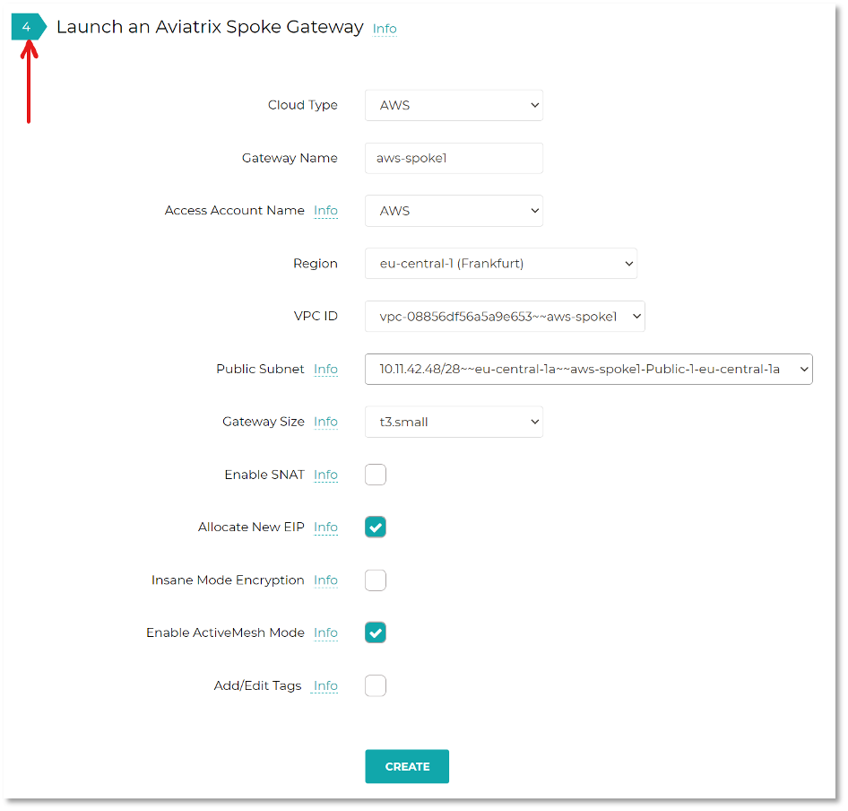  
_Fig. Create Spoke Gateway_  

Make sure you do this for all 3 AWS spoke VPC’s:  
* _shared-aws_
* _aws-spoke1_
* _aws-spoke2_

### Expected Results
Our environment now looks like this:
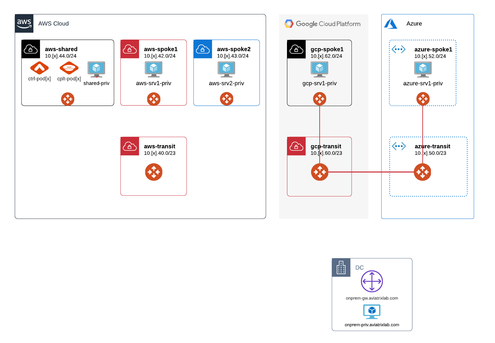  
_Fig. Topology with Spokes_  

Check out CoPilot Topology.    
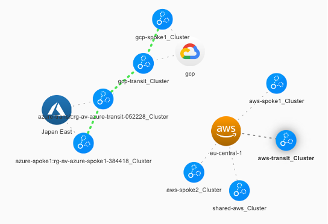  
_Fig. Copilot Topology_

## Lab 2.4 - Attach Spoke Gateways to Aviatrix Transit GW
### Description
We now have all of our gateways deployed. Next we need to set up connectivity between the spoke gateways and the transit gateway.
### Validate
Go to **_step 6a_** on the **_Multi-Cloud Transit -> Setup_** page. Select the spoke gateway and transit gateway as shown below. **Repeat this for all 3 AWS spokes**.  
  
_Fig. Attach Spokes_
### Expected Results
If you now go to the **_Multi-Cloud Transit -> List_** page, you can see the 3 transit gateways and each of the spoke gateways attached to them in the Spoke List. Validate that the spokes you just attached are showing up here.  
  
Our environment now looks like this:
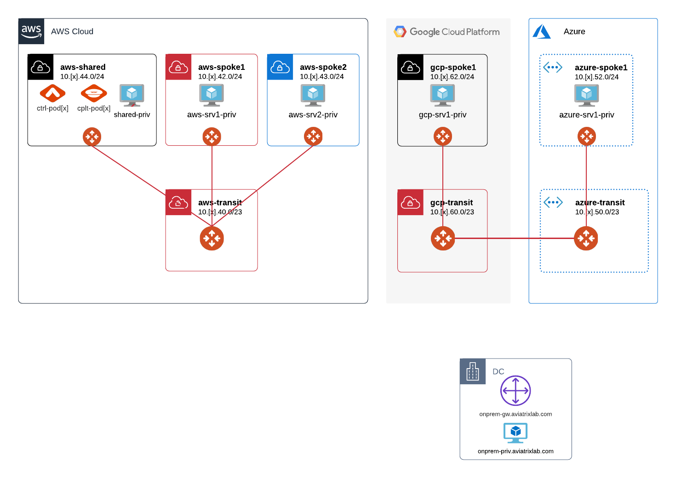  
_Fig. Topology with Attached Spokes_  

Check out CoPilot Topology.    
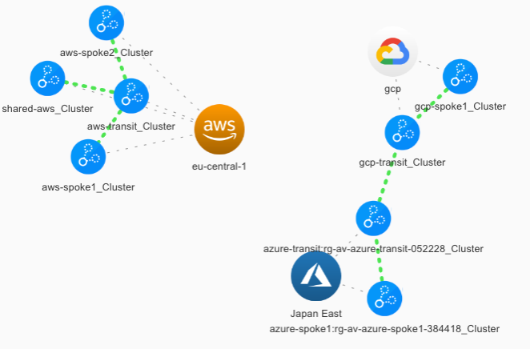  
_Fig. Copilot Topology with Attached Spokes_

## Lab 2.5 - Test Connectivity Between AWS Spokes
### Description
The AWS Spokes should now be connected to the AWS Transit so now we can check connectivity between the spokes.
### Validate
To test the connectivity, we will SSH using the public FQDN of one of our Linux hosts, and run ping to the private FQDNs of the hosts in the other spokes.  
* Connect into AWS-SRV1
* Run the following commands:
```
ping aws-srv2-priv.pod[x].aviatrixlab.com
ping shared-priv.pod[x].aviatrixlab.com
```
> Were you able to ping aws-srv2-priv and shared-priv?

Go to **_Multi-Cloud Transit -> List_** and look at the gateway routing tables for _aws-spoke1_, _AWS-Spoke2_ and _AWS-Shared_.  

By default, routes are not propagated between spokes attached to the same transit gateway. We have to enable a setting on our transit gateway to allow this to happen.  

Go to **_Multi-Cloud Transit -> Advanced Config_**. Select the _AWS-TRANSIT-GW_ and enable _Connected Transit_.

* Connect into AWS-SRV1
* Run the following commands:
```
ping aws-srv2-priv.pod[x].aviatrixlab.com
ping shared-priv.pod[x].aviatrixlab.com
```
* Trace the hops between Spoke1 and Spoke2 in AWS
```
mtr aws-srv2-priv.pod[x].aviatrixlab.com
```
> Were you able to ping aws-srv2-priv and shared-priv?

### Expected Results
After enabling Connected Transit, the spoke to spoke communication tests should now be successful and spoke routes should be propagated.

## Lab 2.6 - Set Up the Multi-Cloud Transit Peering
### Description
Now that we have built the AWS environment, let’s connect it to the Azure and GCP environment.
### Validate
Have a look at **_Multi-Cloud Transit -> Transit Peering_**. As you can see, the _Azure_ and _GCP_ gateways are already peered together. You have validated this connectivity to work already in exercise 1.3.  

Create a new transit peering on this page, by clicking add new. Select the _AWS_ and the _Azure_ gateway (_azure-transit_) and click OK. Wait for the connection to establish.  

* Try to ping the server in Azure and GCP from one of the AWS instances
```
ping gcp-srv1-priv.pod[x].aviatrixlab.com
ping azure-srv1-priv.pod[x].aviatrixlab.com
```
> Were you able to ping aws-srv2-priv and shared-priv?

Now let’s add the peering between _AWS_ and _GCP_ (_gcp-transit_) in the same way.
```
ping gcp-srv1-priv.pod[x].aviatrixlab.com
```

### Expected Results
After adding the transit peerings and creating a full mesh, all resources should be reachable from each of the clouds.  

Our lab environment now looks like this:
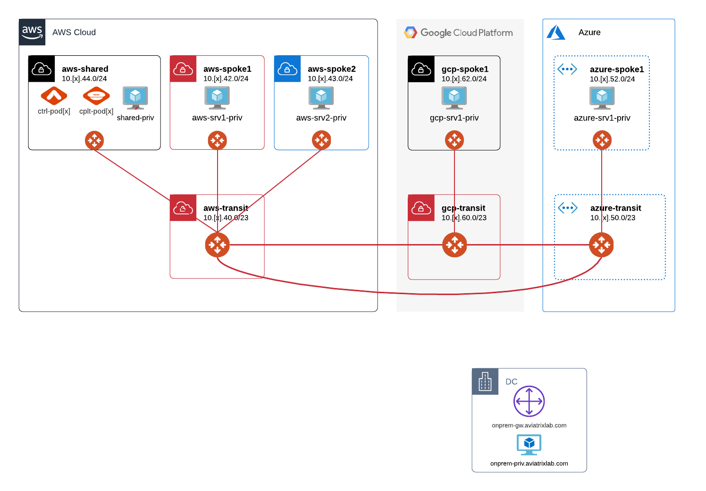  
_Fig. Topology with Transit Peering_  

Have a look at the Dashboard again. You should see all the connectivity on the map.

Topology should show the newly created, beautiful Multi-Cloud full mesh, which should look like this:  
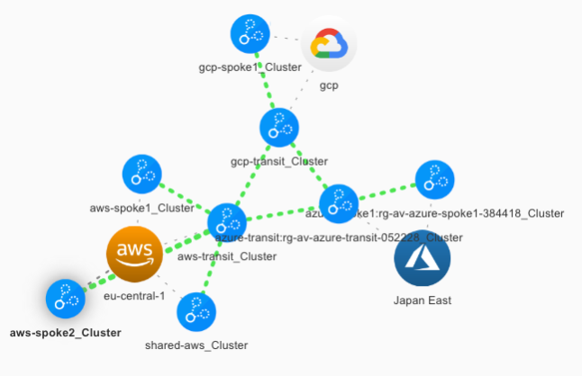  
_Fig. Copilot Topology with Transit Peering_

## Lab 2.7 - Connection to the On-Prem Datacenter
### Description
At this point, all cloud resources should be connected and able to communicate with one another.  The only part that is missing is the connection to On-Prem.
### Validate
In order to connect our Multi-Cloud environment to On-Prem, we will use the **_Multi-Cloud Transit_** workflow.  This allows us to create a secure link between Cloud and On-Prem, and to enable dynamic routing (BGP).  

Before adding On-Prem to our Multi-Cloud environment, let’s enable Route Approval.  Enabling Route Approval is a best practice as one can control the routes learned from On-Premise before distributing them in the cloud.  
To enable Route Approval, navigate to **_Multi-Cloud Transit -> Approval -> Select gcp-transit_** and switch the knob from **Disabled** to **Enabled**.  

Now let’s add the On-Premise Datacenter connection.  Navigate to **_Multi-Cloud Transit -> Setup -> Step 3_**.  Select External Device, select BGP and enter the following information:  

|  |  |
| ------ | ----------- |
| **Transit VPC Name** | gcp-transit |
| **Connection Name** | MyOnPrem |
| **Aviatrix Transit Gateway BGP ASN** | 650[pod#] _For Pods 1-9, pad the pod# with an additional 0 (ie. 65004)_ |
| **Algorithms** | Leave unchecked to select default values |
| **BGP Remote AS Number** | 65000 |
| **Remote Gateway** | <ip-address> _Please resolve the FQDN onprem-cne-gw.aviatrixlab.com_ |
| **Pre-shared Key** | mapleleafs |
| **Local Tunnel IP** | 169.254.[pod#].2/30 |
| **Remote Tunnel IP** | 169.254.[pod#].1/30 |

After 1-2 minutes, under the Site2Cloud menu option, you should see that the connection to On-Prem is green.  In order to test connectivity between cloud and on-prem, a test VM is available with the FQDN onprem-cne-priv.aviatrixlab.com.

* Connect into _GCP-SRV1_
* Run the following commands:
```
ping onprem-cne-priv.aviatrixlab.com
```
> Was the ping successful?

Let’s go back to the **_Multi-Cloud Transit -> Approval -> gcp-transit_** to see which Routes we have learned.  
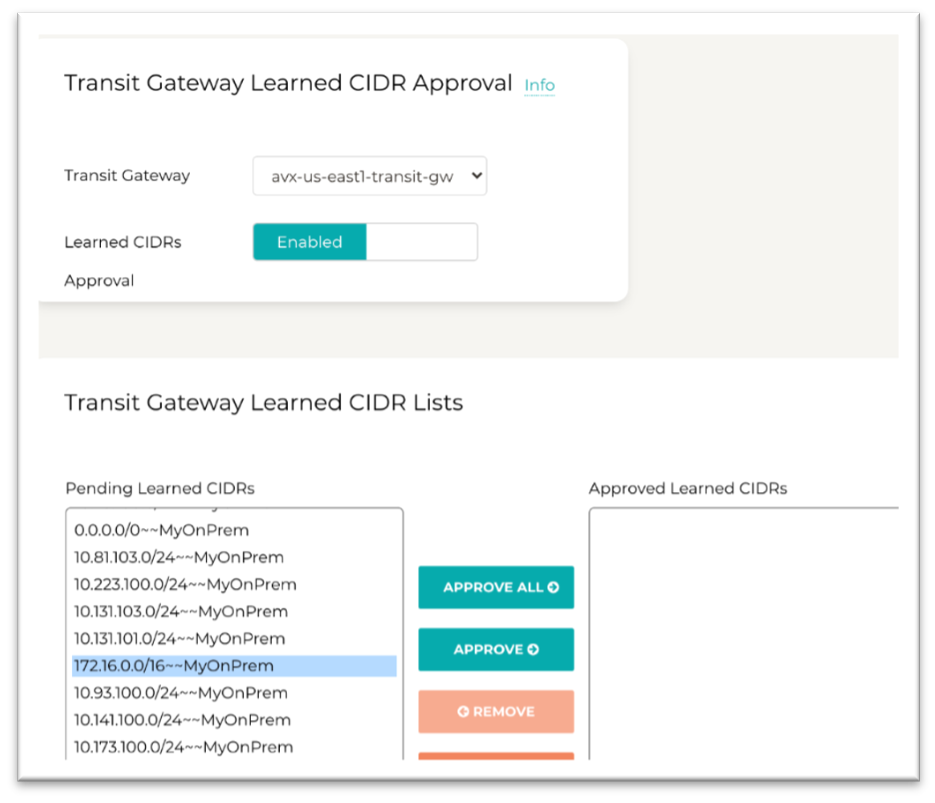  
_Fig. Route Approval_  

Select the appropriate Routes to approve (_10.254.0.0/20_), click _Approve_ and _Update_ and then re-run the connectivity tests. If it does not ping immediately, give it about a minute.

* Connect into _AWS-SRV1_
* Run the following commands:
```
ping onprem-cne-priv.aviatrixlab.com
mtr onprem-cne-priv.aviatrixlab.com
```
* Connect into _GCP-SRV1_
* Run the following commands:
```
ping onprem-cne-priv.aviatrixlab.com
mtr onprem-cne-priv.aviatrixlab.com
```
> Was the ping successful?

### Expected Results
After adding the connection to on-prem and approving the learned routes, the connectivity tests should be successful.  Our lab environment now looks like this:  
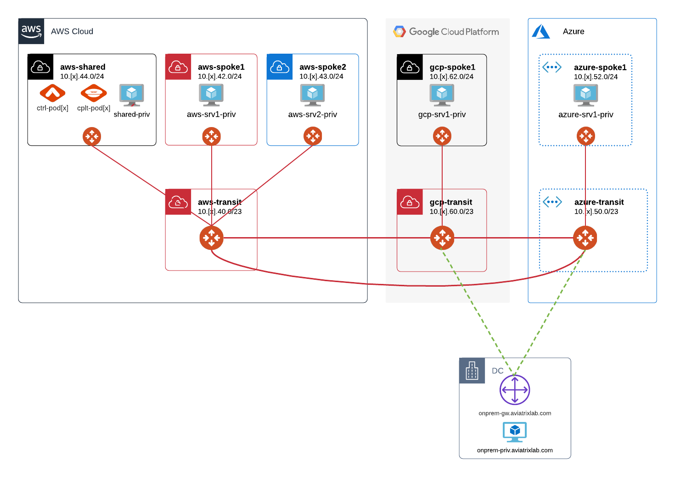  
_Fig. Topology with On-Prem Connectivity_

## Lab 2.8 - Infrastructure as Code (Bonus Lab)
### Description
All the elements you have created through the UI, can also be created through the API or the official **Aviatrix Terraform provider**. You can find more information on these here:  
https://registry.terraform.io/providers/AviatrixSystems/aviatrix/latest/docs

### Validate
We have prepared some Terraform code for you, which you will explore and deploy.

* Connect into AWS-SRV1
* Download the prepared Terraform environment  
```
git clone --branch v0.0.2 https://gitlab.com/dhagens-aviatrix-public/misc/cne-terraform-lab.git
cd cne-terraform-lab
chmod +x setup.sh
./setup.sh
```

Let’s explore the Terraform files we have cloned from the git repository. Explore the file contents of main.tf, variables.tf, providers.tf and vars.tfvars. Use your favorite editor (cat, less, more, vi, nano).

> What do you expect will be created when we run this Terraform code?

In this lab, we are using Terraform modules, provided by Aviatrix. These allow you to quickly build out your environment, based on larger building blocks, rather than individual resources. You can find more available modules here:  

https://registry.terraform.io/namespaces/terraform-aviatrix-modules  

We need to provide our credentials, so Terraform can authenticate against the Aviatrix controller. Edit the file vars.tfvars and fill it out with the correct information.  

Now that we have set up the variables, we need to initialize Terraform. This allows for the required providers and modules to be downloaded.  

```terraform init```

Next we will execute a “plan”. This means that Terraform will compare the live environment with the desired state we declared in our Terraform files

```terraform plan -var-file="vars.tfvars"```

Investigate the proposed changes by Terraform. Now we will apply them to the live environment:

```terraform apply -var-file="vars.tfvars"```

Once Terraform is finished, have a look at the newly created terraform.tfstate file. This contains information of all infrastructure created through Terraform. This is referred to as “the state”. Losing it can cause a lot of trouble, but that is for another (Terraform) lesson.

Log in to the controller and see if you can find the changes that were made. Once you have done that, we will clean up the changes:

```terraform destroy -var-file="vars.tfvars"```

### Expected Results
By cloning the repo, and running the above commands, you should see how simple it can be to automate your infrastructure deployments using Terraform.