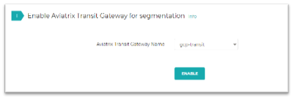
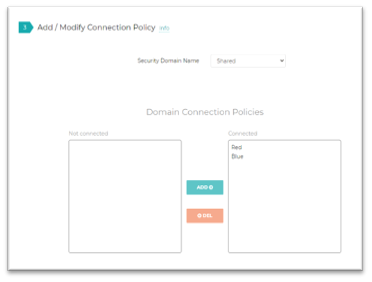
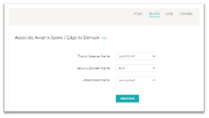
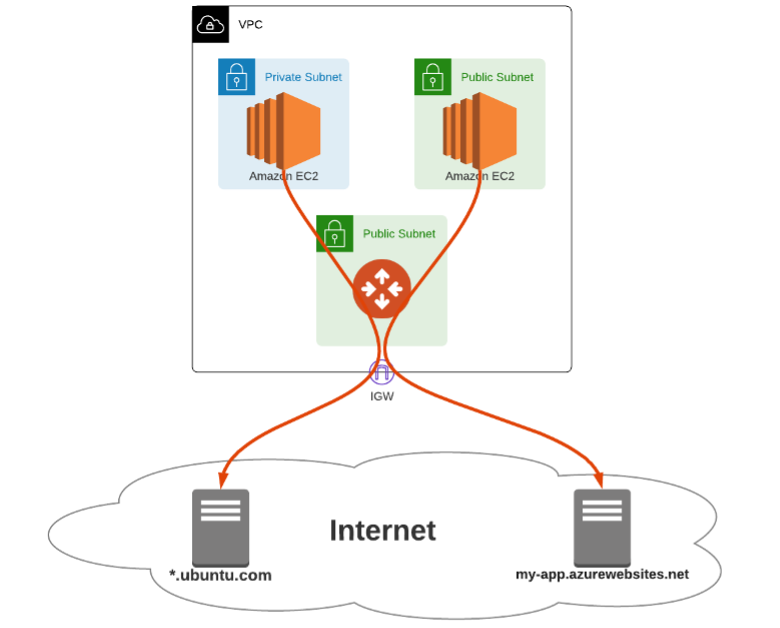
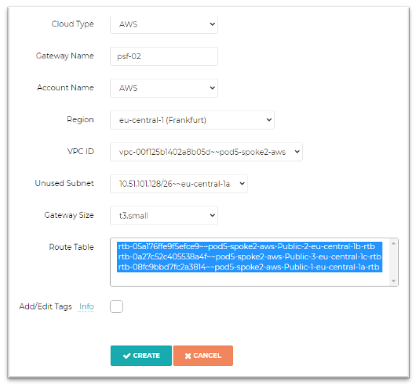
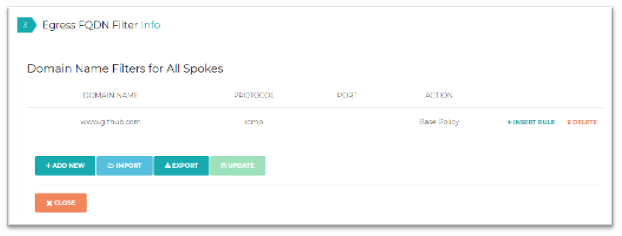
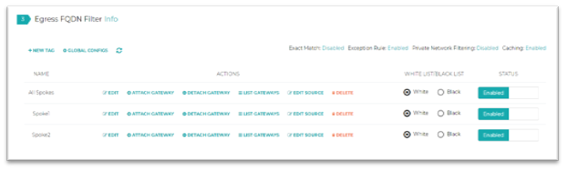

# Lab 3  

## Security Features
Lab time: ~45 minutes  

In this lab, we are going to explore some of the security features that Aviatrix provides. Currently we have open and unlimited communication between all VPC’s and VNET’s and Site2Cloud connection. We rely on security groups/NSG’s to secure the workloads. But what if we need more deliberate segmentation? Aviatrix provides the concept of Security Domains. Let’s see how these work and what they can do for us.

## Lab 3.1 - Enable Segmentation on Transit Gateways
### Description
Until now we have set up a relatively flat any to any network.  Now let's see how we can segment our network by using Aviatrix Multi-Cloud Network Segmentation.
### Validate
Go to **_Multi-Cloud Transit -> Segmentation_**. First we need to enable segmentation for all 3 transit gateways.  
  
_Fig. Enable Segmentation_   

Select the gateway and click enable. **Make sure to do this for all 3 transit gateways**.

### Expected Results
Now that segmentation is enabled on the transits, we can continue and build out Security Domains.

## Lab 3.2 - Create Security Domains
### Description
Now we are going to create some security domains, which we can use for segmentation.

### Validate
Go to **_Multi-Cloud Transit -> Segmentation -> step 2_** , create the following security domains: _Red_, _Blue_, _Shared_ and _Onprem_.  

  
_Fig. Create Security Domains_  

### Expected Results
The 4 security domains should now be created.

## Lab 3.3 - Create Connection Policies
### Description
In order to specify allowed Security Domain to Security Domain communication, we need to set up some Connection Policies.
### Validate
Go to **_Multi-Cloud Transit -> Segmentation -> step 3_** and modify the _Shared_ security domain so it is connected to _Red_ and _Blue_. Also connect security domain _Onprem_ to _Red_.  

  
_Fig. Connection Policies_  

### Expected Results
The above connection policies should now be created.

## Lab 3.4 - Add VPC’s/VNET’s/S2C to Security Domains
### Description
Now we will add each of the Spokes and On-Prem connection to the security domains.
### Validate
Go to **_Multi-Cloud Transit -> Segmentation_** and on the tabs on the top of the page, go to **_Build_**. Create the following associations:

| Transit Gateway Name | Attachment Name | Security Domain Name |
| ------ | ----------- | ---------- |
| aws-transit   | aws-spoke1 | Red |
| aws-transit   | aws-spoke2 | Blue |
| aws-transit   | shared-service | Shared |
| gcp-transit   | gcp-spoke1 | Red |
| azure-transit   | azure-spoke1 | Blue |
| gcp-transit   | MyOnPrem | Onprem |
		
  
_Fig. Security Domain Attachments_  

### Expected Results
Once you have done this, have a look at the Security Domain overview in CoPilot. You will find it by clicking **_Security_** in the menu. This should help you clearly understand the Security Domains and the Connection Policies.

## Lab 3.5 - Connectivity Tests
### Description
Now that we have created our segmentation and connection policies, let’s test what connectivity is possible.
### Validate
* Connect into AWS-SRV1
* Run the following commands:
```
ping aws-srv2-priv.pod[x].aviatrixlab.com
ping azure-srv1-priv.pod[x].aviatrixlab.com
ping gcp-srv1-priv.pod[x].aviatrixlab.com
ping shared-priv.pod[x].aviatrixlab.com
ping onprem-cne-priv.aviatrixlab.com
```

> Can you explain why some ping’s were successful and others weren’t?

* Connect into AWS-SRV2
* Run the following commands:
```
ping aws-srv1-priv.pod[x].aviatrixlab.com
ping azure-srv1-priv.pod[x].aviatrixlab.com
ping gcp-srv1-priv.pod[x].aviatrixlab.com
ping shared-priv.pod[x].aviatrixlab.com
ping onprem-cne-priv.aviatrixlab.com
```

> Can you explain why some ping’s were successful and others weren’t?

### Expected Results
Connectivity tests should only be successful when the necessary Connection Policies are in place between two Security Domains.

## Lab 3.6 - FQDN Filtering
### Description
Another security feature the Aviatrix gateways provide, is FQDN filtering. A common challenge in the cloud is protecting cloud instances from accessing untrusted destinations on the internet. We want to make sure they can only gain access to trusted destinations, like update servers, known API endpoints, etc. FQDN based filtering does exactly that, without having to maintain a list of trusted IP addresses in a NSG or SG.

FQDN Egress filtering is supported in multiple clouds, but we are going to configure it in AWS. AWS has the concept of public and private subnets. Aviatrix can apply FQDN egress filtering on both types of networks. Because our test instances are in the public subnet, we need to set up our environment to filter traffic for public instances.

  
_Fig. Egress Diagram_  

### Validate
First, we are going to deploy a Public Filtering Subnet and a gateway which will do the actual FQDN egress filtering. Go to the **_Security -> Public Subnet_** page. Click **_Add New_**. Create the gateway according to the settings shown below. In order to select all routing tables, you can use shift or control.  

  
_Fig. Egress Gateway Spoke1_  

We need to create another gateway for our second AWS spoke. Create it with the below settings.

  
_Fig. Egress Gateway Spoke2_  

All egress traffic for the subnets that are attached to the selected route tables is now being routed through the filtering gateway. The controller took care of adjusting the routing for us.

Let’s create a new tag for FQDN filtering. A tag is list of domains that are allowed or denied. We can create multiple tags and we can attach multiple tags to gateways.

Go to the **_Security -> Egress Control_** page. Go to step 3 and click **_New Tag_**. Create the following tags: _Spoke1_, _Spoke2_ and _All Spokes_.

We are going to create these tags and add the following domains. **Make sure to hit save and update before you click close!**  

| Tag | Domain | Protocol & Port | Action |
| ------ | ----------- | ---------- | ---------- |
| All Spokes   | www.github.com | ICMP / Empty | Base Policy |
| Spoke1   | www.microsoft.com | ICMP / Empty | Base Policy |
| Spoke2   | www.ubuntu.com | ICMP / Empty | Base Policy |

  
_Fig. Egress Tag Config_  

Next, we need to enable the tags:

  
_Fig. Enable Egress Tags_  

These tags are not yet assigned to our gateways, so they are not yet filtering any traffic. Click **_Attach Gateway_**, and attach the tags as follows:

| Tag | Gateways |
| ------ | ----------- |
| All Spokes   | psf-01, psf-02 |
| Spoke1   | psf-01 |
| Spoke2   | psf-02 |

* Connect into AWS-SRV1 (If you are having trouble connecting, disable the tags, try to connect again and then re-enable the tags)
* Run the following commands:
```
ping www.github.com
ping www.microsoft.com
ping www.ubuntu.com
```

> Can you explain why some ping’s were successful and others weren’t?

* Connect into AWS-SRV2
* Run the following commands:
```
ping www.github.com
ping www.microsoft.com
ping www.ubuntu.com
```

> Can you explain why some ping’s were successful and others weren’t?

You can use the same gateways to filter ingress traffic, with [Aviatrix ThreatIQ and ThreatGuard](https://aviatrix.com/resources/solution-briefs/threatiq-threatguard-datasheet-fnl)! Feel free to play around with this if you have some time.

### Expected Results
The Egress gateways should only allow communication to the URLs specified in the tags, and all other Internet bound traffic should be dropped.
