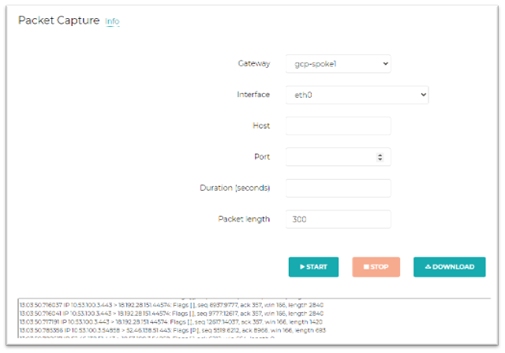
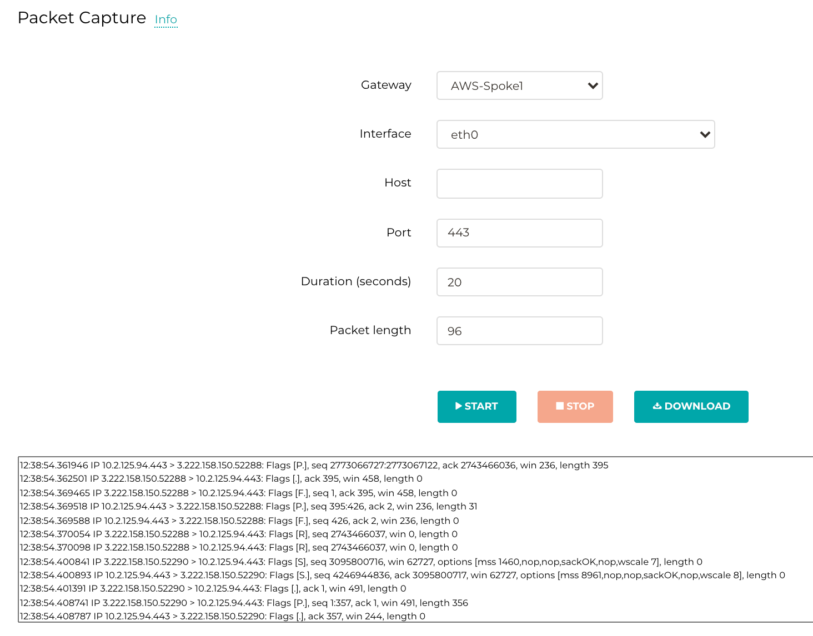
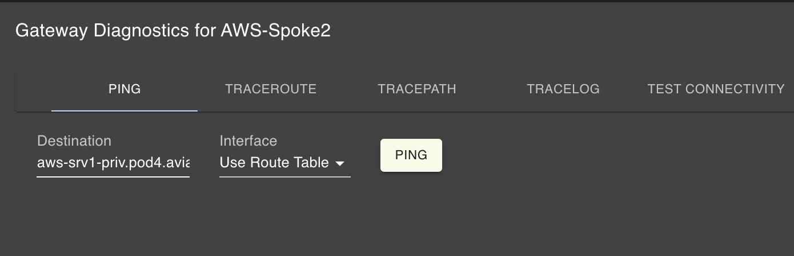
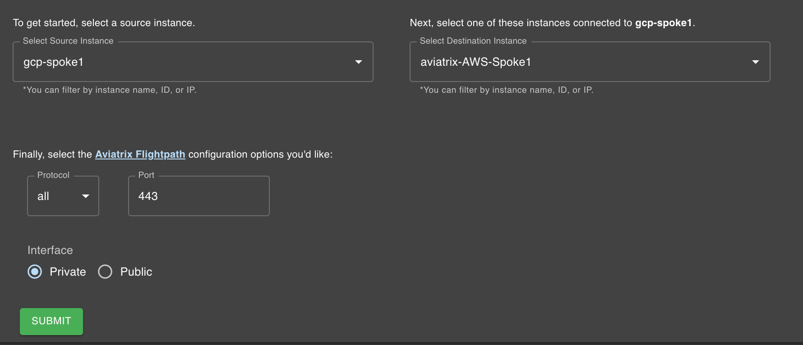
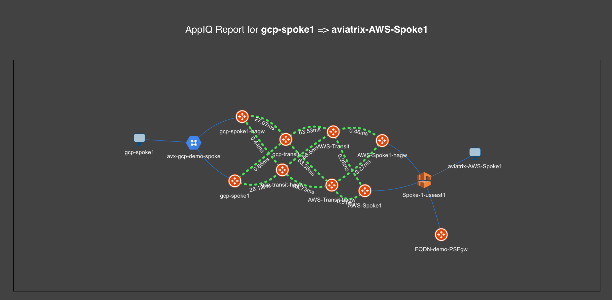
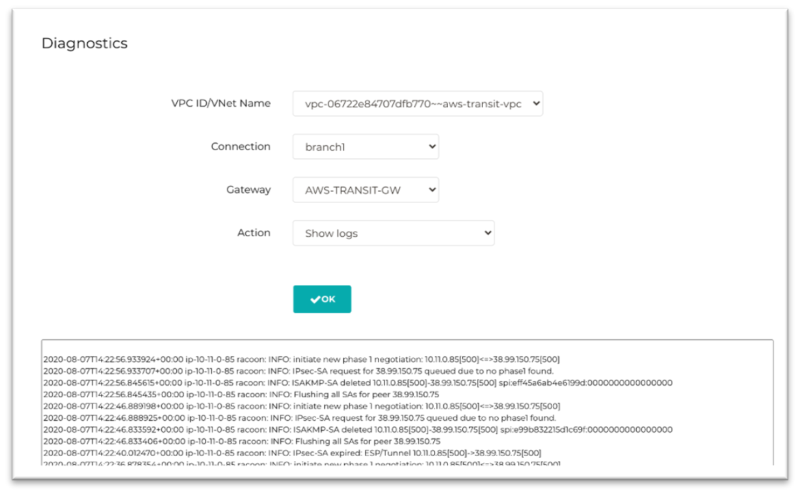
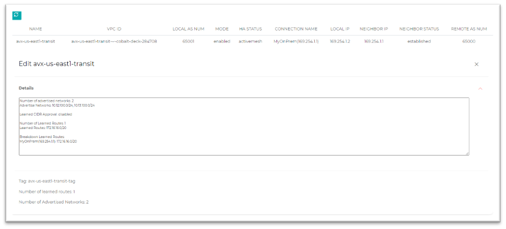
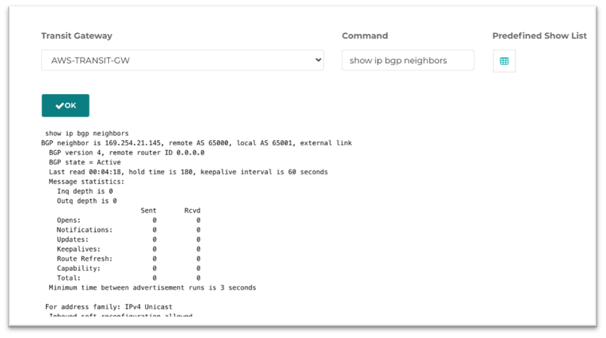
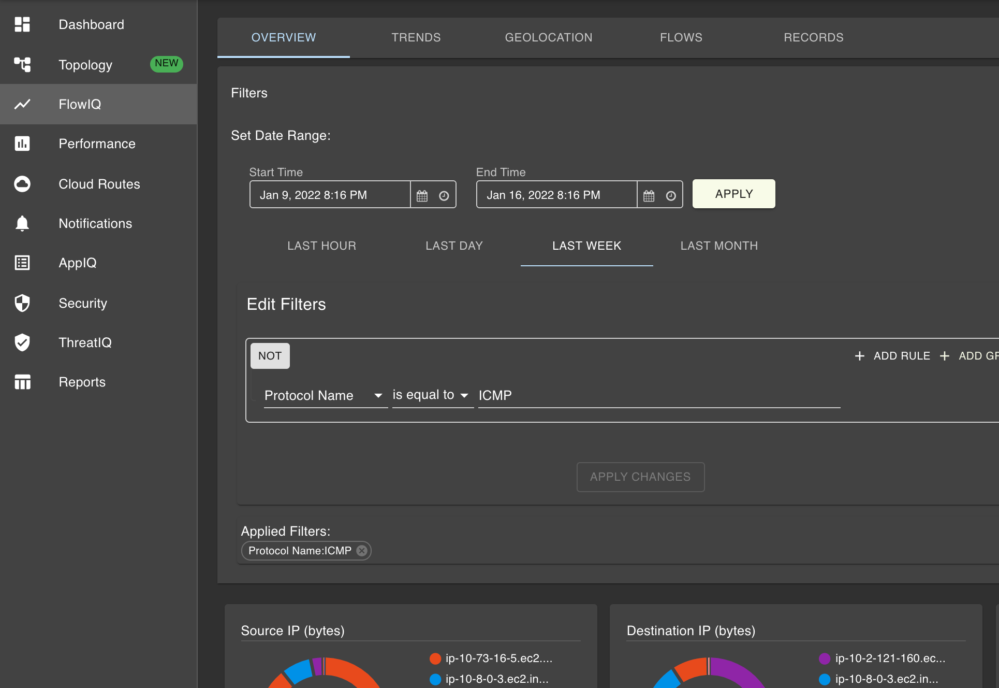

# Lab 4  

## Operations, Visibility and Troubleshooting
Lab time: ~30 minutes  

The focus of this lab will be on using all of the visibility provided by the Aviatrix platform to find that needle in a haystack.  By using Aviatrix, the customer owns the network and is able to have visibility into all traffic flows in the event that troubleshooting is needed.

## Lab 4.1 - Packet Capture
### Description
While operating a cloud environment, there are times where following and capturing packets is necessary.  The Aviatrix Controller allows you to centrally perform and generate packet captures from the Aviatrix Gateways.
### Validate
To start a packet capture, navigate to **_Troubleshoot -> Diagnostics -> Network -> Packet Capture_**.  Select one of the Aviatrix Gateways, the interface (eth0), optionally filter on host and/or port, and click _Start_.  Captured packets will be displayed live - click _Stop_ when finished, download the PCAP and open it in Wireshark.

  
_Fig. Packet Capture_  
### Expected Results
You should be able to view live captured packets in the UI.  By downloading the PCAP and opening the file in Wireshark, you will see more detailed packet information.

  
_Fig. Packet Capture Details_  

## Lab 4.2 - Traceroute, Ping, Telnet
### Description
Using Aviatrix Gateways in the datapath means that you own the datapath.  Another benefit of owning the datapath is having the ability to use some basic but helpful commands such as ```traceroute```, ```tracepath```, ```ping```, ```telnet```, etc.
### Validate
To test this out, open _Co-Pilot_ and navigate to **_Topology_**.  Doubleclick on **_gcp-spoke1_** node (VPC / VNET) that you would like to troubleshoot and click on the orange **Aviatrix Gateway**.  On the right side, click on the **_Diag_** button.  

* Under the **Ping** tab, enter the FQDN ```shared-priv.pod[x].aviatrixlab.com```
* Under the **Traceroute** tab, enter the FQDN ```shared-priv.pod[x].aviatrixlab.com```
* Under the **Test Connectivity** tab, enter the FQDN ```shared-priv.pod[x].aviatrixlab.com``` and Port 22
* Click **Active Sessions** to view the current active sessions running over that Gateway
* Click **Interface Stats** to the gateway interface stats, packet drops, errors, PPS limits, etc

  
_Fig. Gateway Diagnostics_  

### Expected Results
Using the Topology Gateway Diag, you can run pings, traceroutes, etc.  This is helpful when you need to find out why communication to or from a VPC / VNET is not working.

## Lab 4.3 - AppIQ
### Description
**AppIQ** is every cloud operator’s best friend and will always help to find that needle in a haystack.  When a connectivity issue arises between VPCs, regions, clouds, there are many places in the cloud infrastructures that need to be checked.  AppIQ query the cloud providers and show whether Routing at the VPC, Subnet, Gateways, NACLs, and Security Groups are configured correctly at Source and Destination to properly allow the communication.
### Validate
Open CoPilot and navigate to **_AppIQ_**.
* In the **Source Instance** dropdown, select the instance _gcp-srv1_
* In the **Destination Instance** dropdown, select the instance _shared-srv_
* Enter port _443_, select the _Private interface_ and click **Submit**

  
_Fig. AppIQ_  

### Expected Results
AppIQ will show you the path between the selected VMs, will show the latency on each hop, Gateway utilization on each hop and all infrastructure related settings (security groups, route tables, etc).  Scroll through the results - sometimes a simple thing like a missing security group rule can take hours to troubleshoot, but with AppIQ you can get find the issues in seconds or minutes.  

  
_Fig. AppIQ Results_  

## Lab 4.4 - Troubleshooting Site2Cloud and BGP
### Description
The Aviatrix Controller allows you to conveniently view tunnel logs for Site2Cloud connections as well as run BGP commands to get insights into BGP session states, neighbor status, etc.
### Validate
To view the status of a Site2Cloud connection, navigate to **_Site2Cloud -> Diagnostics_**.  Select the _VPC_, _Aviatrix GW_ and **Show Logs**.

  
_Fig. Site2Cloud Status_  

This is helpful in situations where there is a configuration or negotiation issue in either Phase 1 or Phase 2 negotiation.  

Once Site2Cloud connection is up, you can verify the BGP session status **_Multi-Cloud Transit -> Advanced Config -> BGP_**.  Here you will see the state of a selected BGP connection and whether it has learned any routes.  

  
_Fig. BGP Status_  

To run some commands from the GW, click the **_BGP Diagnostics_** tab and select the Aviatrix Transit GW from the list.  Select a command from the list, or type:  ```show ip bgp neighbors```

  
_Fig. BGP Commands_  

### Expected Results
Use the above commands to troubleshoot IPSEC tunnels and BGP connections.

## Lab 4.5 - FlowIQ
### Description
All of the Aviatrix Gateways are configured to stream rich netflow data to CoPilot.  This means that each flow and it's details that goes across your cloud network is visible in CoPilot.  CoPilot offers powerful searching using simple or complex filters, shows top talkers and much more.
### Validate
Login to CoPilot and navigate to **_FlowIQ_**.  In the **Overview** tab, let's create a filter to show all ICMP traffic across the network in the past 24 hours.  

* Click the button **_Last Day_** and then **_Add Rule_** under **_Edit Filters_**
* In the _Select Field_ dropdown, select _Protocol Name_, _is equal to_, and enter **ICMP** in that field
* Click **Apply Changes**

### Expected Results
Find any flow that goes across your cloud network.  In this example we are looking at all pings across the cloud network over the last 24 hours, but you can create much more complex filters.

  
_Fig. FlowIQ_ 