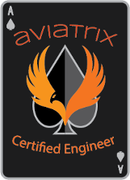

# Summary  

Congratulations, you have completed Aviatrix FlightSchool!  Throughout the labs, we built connectivity in a single cloud, across multiple clouds, and did not have to touch a single Cloud Provider route table entry.  

We also added route domains and connection policies to segment our network, added Internet Egress security and have visibility into all traffic going over the AWS, Azure and GCP cloud networks.  

If you have not done so already, visit the following link to register for the [ACE Associates Certification](https://aviatrix.teachable.com/) program.  Using the voucher ACEMULTICLOUD, you can waive the ACE Associates Course and Exam cost of $1079.  Upon successful completion you will become ACE Associates certified and can then participate in the following additional ACE Courses:

* [ACE Operations](https://aviatrix.com/ace/)
* [ACE Infrastructure as Code](https://aviatrix.com/ace/)
* [ACE Professional](https://aviatrix.com/ace/)

 